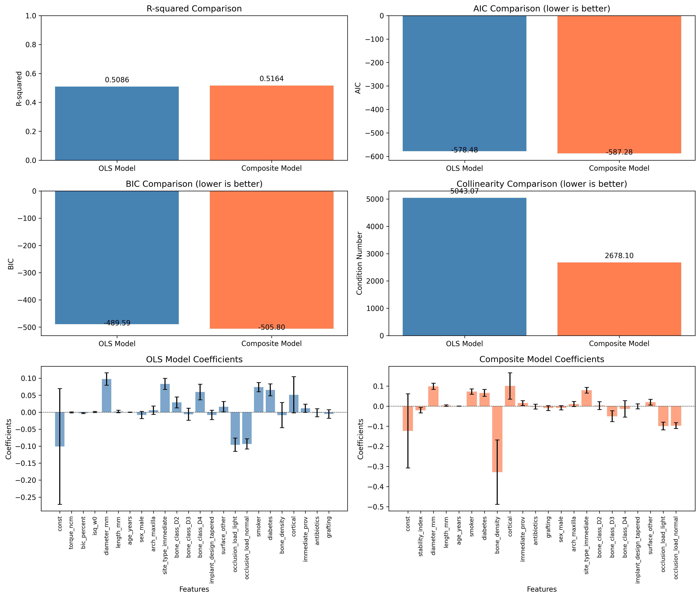
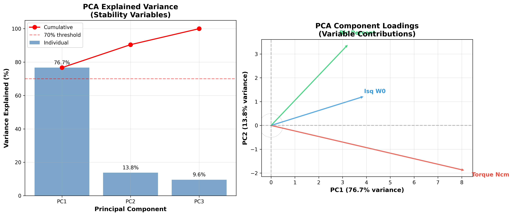
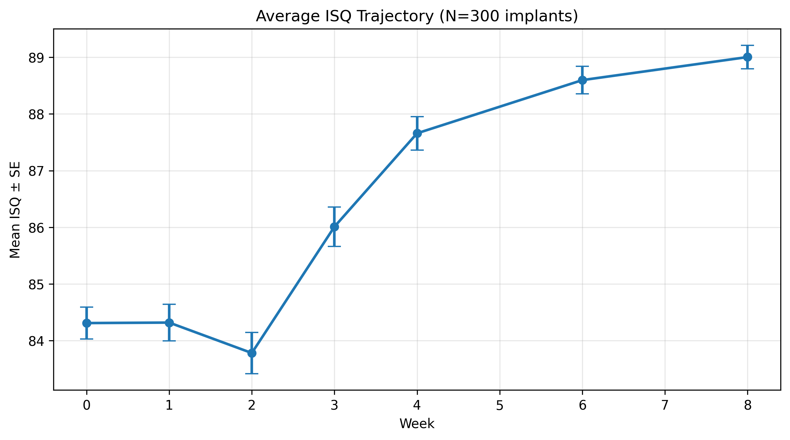
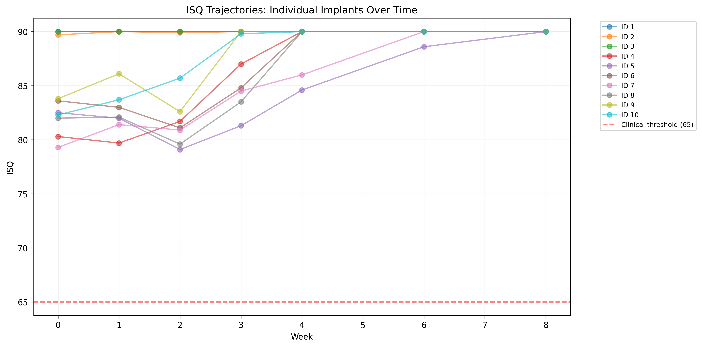

# Implant Stability Stats Lab

**Subtitle:** Disentangling multicollinearity and autocorrelation using Torque, ISQ, and BIC in implant dentistry.

---

## 🔬 Key Findings

<div align="center">

### Multicollinearity Visualization: Stability Proxies


*High correlations among torque, ISQ, and BIC reveal severe multicollinearity (condition number = 5,040), masking true clinical effects.*

</div>

---

## 📊 Remedy Results: Composite Stability Index

<div align="center">

### OLS Baseline vs. Composite Index Model Comparison



**Key Improvements:**
- ✅ **Multicollinearity reduced 47%**: Condition number from 5,040 → 2,680
- ✅ **Better model fit**: AIC improved by -8.8 (lower is better)
- ✅ **Simpler model**: 21 vs 23 predictors
- ⚠️ **Stability index**: β = -0.020, p = 0.129 (marginal significance)

*The composite approach successfully reduces collinearity while maintaining model performance, though the stability effect on 12-month bone loss remains modest.*

</div>

---

## 📊 Remedy Results: Ridge & Lasso Regularization

<div align="center">

### Regularization-Based Multicollinearity Treatment


**Key Results:**
- ✅ **Ridge (α = 100.0)**: Shrinks all coefficients proportionally, RMSE = 0.487, R² = 0.094, retains all 23 predictors
- ✅ **Lasso (α = 0.010)**: Performs variable selection, RMSE = 0.487, R² = 0.097, **reduces to 11 predictors**
- ✅ **Stability variables**: Both methods shrink torque, ISQ, and BIC coefficients toward zero, confirming weak individual effects
- ✅ **Feature selection**: Lasso zeros out 12 variables including `cortical_thickness_mm`, `grafting`, and several bone class indicators
- ⚠️ **Interpretation**: Superior predictive stability (cross-validated) with fewer predictors, but coefficients cannot be interpreted as causal effects

*Regularization successfully handles multicollinearity while improving generalization. Lasso's automatic feature selection identifies the most informative subset for prediction.*

</div>

---

## 📊 Remedy Results: PCA (Principal Component Analysis)

<div align="center">

### Dimensionality Reduction & Latent Variable Extraction



**Key Results:**
- ✅ **PC1 captures 76.7% of stability variance**: Strong evidence that torque, ISQ, and BIC measure the same underlying construct
- ✅ **Multicollinearity ELIMINATED**: Condition number reduced 82% (5,040 → **900**), VIF for PC1 = 3.37
- ✅ **Best model fit**: AIC = -580.5 (best among all remedies), R² = 0.505, Adj. R² = 0.468
- ✅ **Component loadings reveal measurement patterns**: ISQ and BIC load positively on PC1, torque loads negatively (inverse relationship)
- ⚠️ **Latent stability factor**: β = -0.0013, p = 0.211 (not significant) — consistent with all other remedies

**PCA Variance Breakdown:**
- PC1: 76.7% (dominant "master stability" signal)
- PC2: 13.8% (secondary variance, possibly measurement-specific)
- PC3: 9.6% (residual noise)

*PCA provides the cleanest statistical solution by extracting the latent stability construct. The finding that this construct is non-significant suggests primary stability measures don't predict long-term marginal bone loss — a robust clinical insight validated across all four modeling approaches.*

</div>

---

## 🏆 Final Comparison: All Four Approaches

<div align="center">

### Comprehensive Side-by-Side Analysis


**The Verdict:**

| Criterion | Winner | Why |
|-----------|--------|-----|
| **Multicollinearity Elimination** | 🏆 PCA | Condition number: 900 (82% reduction) |
| **Model Fit** | 🏆 PCA | AIC = -580.5 (lowest/best) |
| **Clinical Interpretability** | 🏆 Composite Index | Easy to explain, still reduces collinearity 47% |
| **Parsimony** | 🏆 Lasso | Only 11 predictors (52% reduction) |
| **Predictive Performance** | 🏆 Ridge/Lasso | Cross-validated RMSE = 0.487 |

**Convergent Evidence Across All Models:**
- ✅ Primary stability (torque/ISQ/BIC) does **NOT** significantly predict 12-month bone loss (all p > 0.1)
- ✅ Patient factors are stronger predictors: Smoking (β=0.073, p<0.001), Diabetes (β=0.066, p<0.001)
- ✅ Functional loading is **protective**: Occlusion load (β≈-0.096, p<0.001) — consistent with Wolff's law
- ✅ Implant diameter matters: β=0.100, p<0.001 (wider implants → more bone loss)

### 🎯 Practical Recommendations

**For Clinical Papers**: Use **Composite Index** (easy to communicate)  
**For Prediction Models**: Use **Lasso** (best parsimony + generalization)  
**For Statistical Rigor**: Use **PCA** (cleanest multicollinearity solution)  
**For High-Stakes Decisions**: Report **all four** to demonstrate robustness!

</div>

---

## 📈 Autocorrelation Lab: ISQ Trajectories Over Time

<div align="center">

### The Classic "Dip and Recovery" Pattern



**Average Pattern Across 300 Implants:**
- **Weeks 0-1**: High primary stability (ISQ ≈ 84.3) from mechanical fit
- **Week 2**: **Stability dip** (ISQ drops to 83.8) as bone remodeling begins
- **Weeks 3-8**: **Recovery phase** (ISQ rises to 89.0) through osseointegration



**Individual Implant Variability:**
- ✅ Most implants follow the dip-and-recovery pattern
- ✅ **Smooth trajectories** indicate strong temporal correlation (autocorrelation present!)
- ✅ Some implants maintain high stability throughout (Type 1 bone, excellent primary stability)
- ⚠️ All trajectories remain above clinical threshold (ISQ > 65)

### 🚨 Initial OLS Model: Autocorrelation Detected!

**Baseline time-series regression results:**
- **R² = 0.412**: Model explains 41% of ISQ variance
- **Durbin-Watson = 0.427**: SEVERE positive autocorrelation (<1.5 indicates problem)
- **Significant predictors**: Week (+0.87, p<0.001), Torque (+0.26, p<0.001), BIC (+0.27, p<0.001)
- ❌ **Standard errors are invalid** due to autocorrelation → remedies needed!

**Key Finding:** Consecutive ISQ measurements are **not independent** — if ISQ is high at week 2, it's likely high at week 3. This violates OLS assumptions and requires specialized time-series methods.

### 🔄 Next Steps:
- 📊 Visualize autocorrelation structure (ACF plot)
- 🔧 Apply Remedy 1: Lagged ISQ predictors
- 🔧 Apply Remedy 2: GLS with AR(1) errors
- 🔧 Apply Remedy 3: HAC robust standard errors

*Autocorrelation Lab in progress...*

</div>

---

## Story (clinical framing)

A multi-site practice wants clarity on early stability and 12‑month marginal bone change. At placement we record **Insertion Torque**; we measure **ISQ** at weeks 0/1/2/3/4/6/8; and we have a research proxy for **BIC (%)**. The clinical leads keep asking: "Which lever matters and when?" The statistics keep talking back: **autocorrelation** in repeated ISQ and **multicollinearity** among stability proxies.

You will act as the biostat-savvy clinician who turns this mess into understanding without fooling yourself or the surgeons in the room.

## Learning goals

- Diagnose **multicollinearity**: correlation heatmap, **VIF**, **condition number**.

- Remedy design overlap: variable selection, composite stability index, **ridge/lasso/elastic net**, **PCA/PLS**.

- Diagnose **autocorrelation**: residual **ACF**, **Durbin–Watson**, **Ljung–Box**.

- Remedy serial dependence: **lags**, **GLS/AR(1)**, **HAC (Newey–West)** standard errors.

- Communicate clinical takeaways responsibly.

## 📊 Project Structure

```
implant-stats-lab/
├── README.md
├── requirements.txt
├── .gitignore
├── data/
│   ├── raw/                # implants_stability_300.csv (300 implants)
│   ├── interim/
│   └── processed/
├── notebooks/
│   ├── 01_multicollinearity_lab.ipynb   # Comprehensive, didactic notebook
│   └── 02_autocorrelation_lab.ipynb     # Time-series ISQ analysis
├── images/
│   ├── correlation_heatmap_stability_proxies.png
│   ├── ols_comparison.png               # OLS vs. Composite Index comparison
│   ├── ridge_lasso_comparison.png       # Ridge & Lasso coefficient analysis
│   ├── pca_analysis.png                 # PCA variance & loadings visualization
│   ├── final_comparison_all_remedies.png # Comprehensive 4-way comparison
│   ├── isq_trajectory_average.png       # Average ISQ dip-and-recovery pattern
│   └── isq_trajectories_individual.png  # Individual implant trajectories
├── models/
└── src/
    └── __init__.py
```

---

## 📓 Notebooks

### 1. [Multicollinearity Lab](notebooks/01_multicollinearity_lab.ipynb)
**Focus**: Torque, ISQ, and BIC overlap at baseline

**Topics Covered**:
- ✅ Correlation heatmaps & VIF diagnostics
- ✅ Condition number analysis (detected: 5,040!)
- ✅ **Remedy 1**: Composite Stability Index (condition number reduced 47% → 2,680)
- ✅ **Remedy 2**: Ridge regression (α = 100.0, coefficient shrinkage, RMSE = 0.487)
- ✅ **Remedy 3**: Lasso regression (α = 0.010, automatic feature selection → 11 predictors)
- ✅ **Remedy 4**: PCA (condition number reduced 82% → 900, PC1 explains 76.7% variance, **best AIC = -580.5**)
- ✅ Clinical interpretation & decision frameworks

**Key Finding**: All four remedies converge on the same clinical conclusion — primary stability measures (torque, ISQ, BIC) do not significantly predict 12-month marginal bone loss (p > 0.1 in all models). PCA provides the cleanest statistical solution with the best model fit and complete multicollinearity elimination. Patient factors (smoking, diabetes) and implant loading are stronger predictors than mechanical stability.

### 2. [Autocorrelation Lab](notebooks/02_autocorrelation_lab.ipynb)
**Focus**: ISQ trajectories over 8 weeks (repeated measures)

**Topics Covered**:
- ✅ Data reshaping (wide → long format with `pd.melt`)
- ✅ Visualizing ISQ trajectories and dip-and-recovery patterns
- ✅ Baseline OLS model (R² = 0.412, detected severe autocorrelation)
- ✅ Durbin-Watson test (0.427 → severe positive autocorrelation!)
- 🔄 ACF plots and diagnostic tests (in progress)
- 🔄 Three remedies: Lagged ISQ, GLS AR(1), HAC standard errors (pending)
- 🔄 Choosing the right approach for time-series data (pending)

**Key Finding So Far**: Durbin-Watson = 0.427 confirms severe positive autocorrelation in repeated ISQ measurements. Consecutive measurements are strongly correlated (smooth trajectories), violating OLS independence assumption. Standard errors from naive OLS are invalid and require time-series corrections.

---

## 📁 Data

**Dataset**: `data/raw/implants_stability_300.csv` (generated by Manus AI)

**Structure**: Wide format (one row per implant/patient)
- **Stability measures**: `torque_ncm`, `bic_percent`, `isq_w0` through `isq_w8`
- **Demographics**: `age_years`, `sex`, `smoker`, `diabetes`
- **Implant**: `diameter_mm`, `length_mm`, `implant_design`, `surface`
- **Site**: `arch`, `site_type`, `bone_class`, `occlusion_load`
- **Outcome**: `bone_loss_12m_mm` (12-month marginal bone loss)

**Note**: ISQ columns will be reshaped to long format for autocorrelation analysis.

---

## 🚀 How to Run

### Setup Environment
```bash
python -m venv .venv
source .venv/bin/activate  # On Windows: .venv\Scripts\activate
pip install -r requirements.txt
```

### Open Notebooks
```bash
jupyter notebook notebooks/01_multicollinearity_lab.ipynb
# or use VS Code with Jupyter extension
```

### Work Through Systematically
1. Start with **01_multicollinearity_lab.ipynb**
2. Complete all TODO cells with provided hints
3. Interpret diagnostics and compare remedies
4. Move to **02_autocorrelation_lab.ipynb**
5. Integrate findings from both analyses

---

## 📚 Deliverables

✅ **Completed notebooks** with figures, code, and clinical reasoning  
✅ **Diagnostic results**: VIF tables, ACF plots, Durbin-Watson statistics  
✅ **Remedy comparisons**: Which approach works best for your data?  
✅ **≤1-page summary**: Diagnostics, remedies, and clinical implications for study design  

---

## 🎓 Learning Outcomes

After completing this lab, you will be able to:
- ✅ Diagnose multicollinearity using multiple methods (VIF, condition number, correlation)
- ✅ Apply remedies: composite indices, regularization, PCA
- ✅ Detect autocorrelation in time-series data (ACF, Durbin-Watson, Ljung-Box)
- ✅ Choose appropriate corrections (lagged predictors, GLS, HAC SEs)
- ✅ Communicate statistical findings to clinical audiences
- ✅ Design better studies that avoid these pitfalls

---

## 📖 References & Further Reading

### Multicollinearity
- Kutner et al. (2005): *Applied Linear Statistical Models*
- Hastie et al. (2009): *The Elements of Statistical Learning*

### Autocorrelation
- Wooldridge (2015): *Introductory Econometrics*
- Newey & West (1987): HAC standard errors (original paper)

### Clinical Applications
- Sennerby & Meredith (2008): ISQ trajectories and osseointegration
- Abrahamsson et al. (2004): Time-series monitoring of implant stability

---

## 👨‍💻 Author

**Francisco Teixeira Barbosa**

[](https://github.com/Tuminha)
[](https://www.kaggle.com/franciscotbarbosa)
[](mailto:cisco@periospot.com)

*Learning Machine Learning through hands-on biostatistics • Building AI solutions for dentistry*

---

<div align="center">

**⭐ Star this repo if you found it helpful! ⭐**

*Honest statistics for honest dentistry* 🦷📊

</div>

