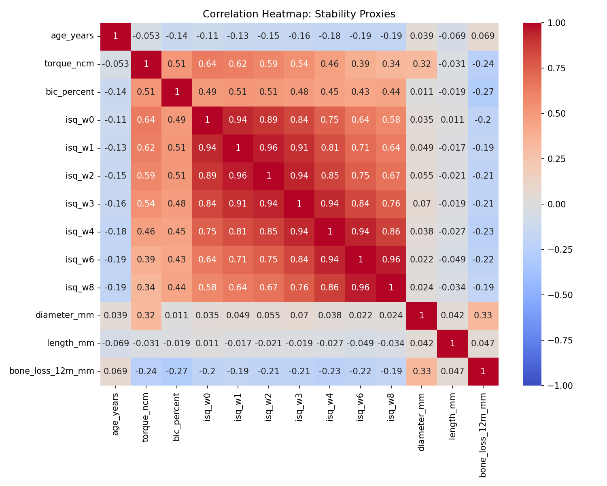

# Implant Stability Stats Lab

**Subtitle:** Disentangling multicollinearity and autocorrelation using Torque, ISQ, and BIC in implant dentistry.

---

## 🔬 Key Findings

<div align="center">

### Multicollinearity Visualization: Stability Proxies



*High correlations among torque, ISQ, and BIC reveal severe multicollinearity (condition number = 5,040), masking true clinical effects.*

</div>

---

## Story (clinical framing)

A multi-site practice wants clarity on early stability and 12‑month marginal bone change. At placement we record **Insertion Torque**; we measure **ISQ** at weeks 0/1/2/3/4/6/8; and we have a research proxy for **BIC (%)**. The clinical leads keep asking: "Which lever matters and when?" The statistics keep talking back: **autocorrelation** in repeated ISQ and **multicollinearity** among stability proxies.

You will act as the biostat-savvy clinician who turns this mess into understanding without fooling yourself or the surgeons in the room.

## Learning goals

- Diagnose **multicollinearity**: correlation heatmap, **VIF**, **condition number**.

- Remedy design overlap: variable selection, composite stability index, **ridge/lasso/elastic net**, **PCA/PLS**.

- Diagnose **autocorrelation**: residual **ACF**, **Durbin–Watson**, **Ljung–Box**.

- Remedy serial dependence: **lags**, **GLS/AR(1)**, **HAC (Newey–West)** standard errors.

- Communicate clinical takeaways responsibly.

## 📊 Project Structure

```
implant-stats-lab/
├── README.md
├── requirements.txt
├── .gitignore
├── data/
│   ├── raw/                # implants_stability_300.csv (300 implants)
│   ├── interim/
│   └── processed/
├── notebooks/
│   ├── 01_multicollinearity_lab.ipynb   # Comprehensive, didactic notebook
│   └── 02_autocorrelation_lab.ipynb     # Time-series ISQ analysis
├── images/
│   └── correlation_heatmap_stability_proxies.png
├── models/
└── src/
    └── __init__.py
```

---

## 📓 Notebooks

### 1. [Multicollinearity Lab](notebooks/01_multicollinearity_lab.ipynb)
**Focus**: Torque, ISQ, and BIC overlap at baseline

**Topics Covered**:
- ✅ Correlation heatmaps & VIF diagnostics
- ✅ Condition number analysis (detected: 5,040!)
- ✅ Three remedies: Composite Index, Ridge/Lasso, PCA
- ✅ Clinical interpretation & decision frameworks

**Key Finding**: All three stability measures non-significant (p > 0.1) when included together due to extreme multicollinearity — despite clinical importance!

### 2. [Autocorrelation Lab](notebooks/02_autocorrelation_lab.ipynb)
**Focus**: ISQ trajectories over 8 weeks (repeated measures)

**Topics Covered**:
- ✅ ACF plots, Durbin-Watson, Ljung-Box tests
- ✅ Visualizing dip-and-recovery patterns
- ✅ Three remedies: Lagged ISQ, GLS AR(1), HAC standard errors
- ✅ Choosing the right approach for time-series data

**Key Finding**: Positive autocorrelation in repeated ISQ measurements requires correction for valid inference.

---

## 📁 Data

**Dataset**: `data/raw/implants_stability_300.csv` (generated by Manus AI)

**Structure**: Wide format (one row per implant/patient)
- **Stability measures**: `torque_ncm`, `bic_percent`, `isq_w0` through `isq_w8`
- **Demographics**: `age_years`, `sex`, `smoker`, `diabetes`
- **Implant**: `diameter_mm`, `length_mm`, `implant_design`, `surface`
- **Site**: `arch`, `site_type`, `bone_class`, `occlusion_load`
- **Outcome**: `bone_loss_12m_mm` (12-month marginal bone loss)

**Note**: ISQ columns will be reshaped to long format for autocorrelation analysis.

---

## 🚀 How to Run

### Setup Environment
```bash
python -m venv .venv
source .venv/bin/activate  # On Windows: .venv\Scripts\activate
pip install -r requirements.txt
```

### Open Notebooks
```bash
jupyter notebook notebooks/01_multicollinearity_lab.ipynb
# or use VS Code with Jupyter extension
```

### Work Through Systematically
1. Start with **01_multicollinearity_lab.ipynb**
2. Complete all TODO cells with provided hints
3. Interpret diagnostics and compare remedies
4. Move to **02_autocorrelation_lab.ipynb**
5. Integrate findings from both analyses

---

## 📚 Deliverables

✅ **Completed notebooks** with figures, code, and clinical reasoning  
✅ **Diagnostic results**: VIF tables, ACF plots, Durbin-Watson statistics  
✅ **Remedy comparisons**: Which approach works best for your data?  
✅ **≤1-page summary**: Diagnostics, remedies, and clinical implications for study design  

---

## 🎓 Learning Outcomes

After completing this lab, you will be able to:
- ✅ Diagnose multicollinearity using multiple methods (VIF, condition number, correlation)
- ✅ Apply remedies: composite indices, regularization, PCA
- ✅ Detect autocorrelation in time-series data (ACF, Durbin-Watson, Ljung-Box)
- ✅ Choose appropriate corrections (lagged predictors, GLS, HAC SEs)
- ✅ Communicate statistical findings to clinical audiences
- ✅ Design better studies that avoid these pitfalls

---

## 📖 References & Further Reading

### Multicollinearity
- Kutner et al. (2005): *Applied Linear Statistical Models*
- Hastie et al. (2009): *The Elements of Statistical Learning*

### Autocorrelation
- Wooldridge (2015): *Introductory Econometrics*
- Newey & West (1987): HAC standard errors (original paper)

### Clinical Applications
- Sennerby & Meredith (2008): ISQ trajectories and osseointegration
- Abrahamsson et al. (2004): Time-series monitoring of implant stability

---

## 👨‍💻 Author

**Francisco Teixeira Barbosa**

[](https://github.com/Tuminha)
[](https://www.kaggle.com/franciscotbarbosa)
[](mailto:cisco@periospot.com)

*Learning Machine Learning through hands-on biostatistics • Building AI solutions for dentistry*

---

<div align="center">

**⭐ Star this repo if you found it helpful! ⭐**

*Honest statistics for honest dentistry* 🦷📊

</div>

